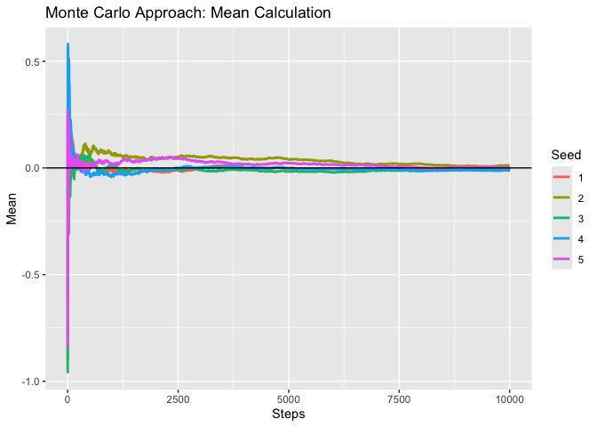
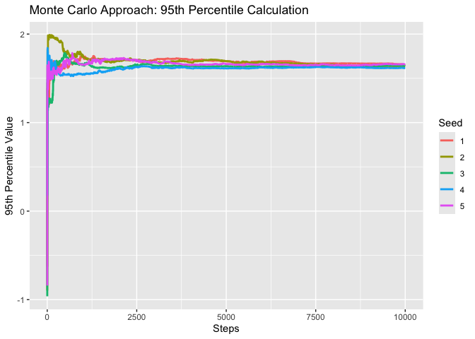
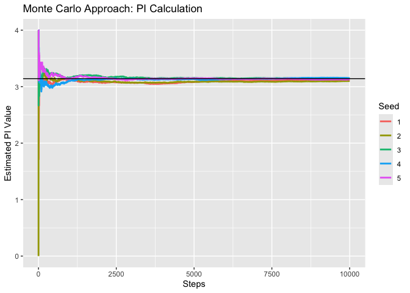

PS 2
================
Emma Vejcik \
2025-01-22

# Task

Use a Monte Carlo simulation method to: 

* determine the mean and the 95
percentile from a known univariate normal distribution with a mean of
zero and a standard deviation of one with your estimated uncertainties
and

* determine the value of pi with your estimated uncertainties.

# Approach & Analysis

In order to calculate the mean of a univariate normal distribution with
mean = 0 and SD = 1, I generated 10,000 samples taken from the
distribution and calculated the cumulative means from these samples,
i.e., at step 1, I took the mean of 1 sample, at step 2, I took the mean
of 2 samples, at step 10,000, I took the mean of 10,000 samples.

In order to calculate the 95th percentile of the same distribution, I
followed a similar method. By sampling up to 10,000 samples in 10,000
steps, I found the 95th percentile at each step.

I took the same approach with finding an analytical solution for PI. By
knowing that the definition of the area of a square vs. the area of a
circle = $\frac{π}{4}$, we can therefore procede knowing that $π$ is
defined as 4 \* the ratio of the area of a square vs. the area of a
circle. By creating a uniform distribution centered at 0 with a side
length of 2, I was able to simulate a distribution in the shape of a
square. By finding a circle inscribed within the square and simulating
how many randomly sampled points fall within the circle vs. within the
square, we can generate an approximate analytical solution for the true
value of $π$.

### Choices

Some of the major choice that I made were: setting the seed, how many
samples to take from each distribution, my stopping condition, and my
measure of uncertainty. I could have chosen any set of seeds but
arbitrarily chose to use values 1-5 for each problem. I decided upon
using up to 10,000 samples as I believed that 1,000 samples would have
been too small a selection and working with 100,000 samples would have
been too time-consuming. Additionally, after running each experiment to
completion, based on my stopping condition, I came to believe that
10,000 samples would suffice.

### Assumptions

For all 3 tasks, my stopping condition was “it looks about right”, based
on the assumption that if the values plotted on the data visualization
looked like they had converged (to my eye) and that 10,000 samples would
be enough to show convergence. While I could have implemented a stopping
condition based on how much the estimated mean differed from step to
step, this would also have been an assumption and also based, at some
point, on my subjective decision of what would be “good enough”.

### Uncertainty

In terms of uncertainty, the two main sources of uncertainty within my
simulation are: the set seed and the number of steps taken. By measuring
the range of values across different seeds at the beginning of the
simulation vs. the end of the simulation, we can have at least some idea
of how uncertainty has been handled in the simulation. I could have used
alternate choices of metrics, such as the standard deviation, average,
or variation between values at each seed but ultimately chose to use
range as I believe it constituted the simplest approach.

We can see that as the step size increases, the range between values
decreases - with more iterations, we can mollify our uncertainty.

The range for the mean decreased by 98.0%. The range for the 95th
percentile decreased by 96.4%. The range for $π$ decreased by 98.7%.

### Reproducibility

These analyses are reproducible. As I have provided the code and
selected seed and do not rely on any other direct tools in order to
produce my results, a user should be able to easily rerun the software
on their own machine and obtain the exact results with R version 4.4.2.

``` r
library(tidyverse)
```

    ## ── Attaching core tidyverse packages ──────────────────────── tidyverse 2.0.0 ──
    ## ✔ dplyr     1.1.4     ✔ readr     2.1.5
    ## ✔ forcats   1.0.0     ✔ stringr   1.5.1
    ## ✔ ggplot2   3.5.1     ✔ tibble    3.2.1
    ## ✔ lubridate 1.9.4     ✔ tidyr     1.3.1
    ## ✔ purrr     1.0.2     
    ## ── Conflicts ────────────────────────────────────────── tidyverse_conflicts() ──
    ## ✖ dplyr::filter() masks stats::filter()
    ## ✖ dplyr::lag()    masks stats::lag()
    ## ℹ Use the conflicted package (<http://conflicted.r-lib.org/>) to force all conflicts to become errors

# Code Appendix

### Mean

``` r
##Mean

# Parameters
n <- 10000  
seeds <- 1:5     

# Generate cumulative means for each seed
means_df <- map_dfr(seeds, ~ {
  set.seed(.x)
  #generate 10000 samples from univariate distrib w mean = 0, sd = 1
  samples <- rnorm(n, mean = 0, sd = 1)
  
  #for every step, generate average of samples again
  cum_mean <- cumsum(samples) / seq_along(samples)
  
  data.frame(
    step = 1:n,        
    mean_hat = cum_mean,
    seed = as.factor(.x)              
  )
})
```

``` r
##Calculate range of values for first step vs. last step:
first_last_seed <- means_df %>%
  group_by(seed) %>%
  slice_min(order_by = step, n = 1) %>%  #first row
  bind_rows(
    means_df %>%
      group_by(seed) %>%
      slice_max(order_by = step, n = 1)) %>%   #last row
  ungroup() %>% 
  group_by(step) %>% 
  mutate(first = ifelse(step == 1, TRUE, FALSE)) %>% 
  mutate(last = ifelse(step == 10000, TRUE, FALSE) )

aggro_df <- first_last_seed %>%
  # group_by(seed) %>% 
  group_by(first) %>% 
  summarize(
    min_mean_hat = min(mean_hat),
    max_mean_hat = max(mean_hat),
    range = max_mean_hat - min_mean_hat
  )
```

``` r
# Plot means per step factored by color
ggplot(means_df, aes(x = step, y = mean_hat, color = seed)) +
  geom_line(size = 1) +
  geom_hline(yintercept = 0, color = "black") +  
  labs(
    title = "Monte Carlo Approach: Mean Calculation",
    x = "Steps",
    y = "Mean",
    color = "Seed"
  )
```

<!-- -->

### 95th Percentile

``` r
##95th Percentile

percentile_df <- map_dfr(seeds, ~ {
  set.seed(.x)
  #generate 10000 samples from uniform distrib w mean = 0, sd = 1
  samples <- rnorm(n, mean = 0, sd = 1)
  
  #for every step, generate 95th percentile of samples again
  cum_95 <- sapply(1:n, function(i) quantile(samples[1:i], 0.95))
  
  # Return a data frame for this seed
  data.frame(
    step = 1:n,         
    hat_95 = cum_95,    
    seed = as.factor(.x)  
  )
})
```

``` r
##Calculate range of values for first step vs. last step:
first_last_seed <- percentile_df %>%
  group_by(seed) %>%
  slice_min(order_by = step, n = 1) %>%  #first row
  bind_rows(
    percentile_df %>%
      group_by(seed) %>%
      slice_max(order_by = step, n = 1)) %>%   #last row
  ungroup() %>% 
  group_by(step) %>% 
  mutate(first = ifelse(step == 1, TRUE, FALSE)) %>% 
  mutate(last = ifelse(step == 10000, TRUE, FALSE) )

aggro_df <- first_last_seed %>%
  # group_by(seed) %>% 
  group_by(first) %>% 
  summarize(
    min_95_hat = min(hat_95),
    max_95_hat = max(hat_95),
    range = max_95_hat - min_95_hat
  )
```

``` r
# Plot means per step factored by color
ggplot(percentile_df, aes(x = step, y = hat_95, color = seed)) +
  geom_line(size = 1) +
  labs(
    title = "Monte Carlo Approach: 95th Percentile Calculation",
    x = "Steps",
    y = "95th Percentile Value",
    color = "Seed"
  )
```

<!-- -->

### PI

``` r
##PI

pi_df <- map_dfr(seeds, ~ {
  set.seed(.x)
  #generate 10000 samples from square centered at 0 with sides = 2
  x <- runif(n, -1,1)
  y <- runif(n, -1,1)
  
  inside_circle <- x^2 + y^2 <=1
  
  #circ area = PI * r^2 
  #square area = (2r)^2
  #solve for ratio: ratio = PI / 4
  #therefore multiply by 4 to get PI
  
  #for every step, generate 4*mean of samples again
  cum_pi <- sapply(1:n, function(i) 4*mean(inside_circle[1:i]))
  
  # Return a data frame for this seed
  data.frame(
    step = 1:n,         
    pi_hat = cum_pi,    
    seed = as.factor(.x)  
  )
})
```

``` r
##Calculate range of values for first step vs. last step:
first_last_seed <- pi_df %>%
  group_by(seed) %>%
  slice_min(order_by = step, n = 1) %>%  #first row
  bind_rows(
    pi_df %>%
      group_by(seed) %>%
      slice_max(order_by = step, n = 1)) %>%   #last row
  ungroup() %>% 
  group_by(step) %>% 
  mutate(first = ifelse(step == 1, TRUE, FALSE)) %>% 
  mutate(last = ifelse(step == 10000, TRUE, FALSE) )

aggro_df <- first_last_seed %>%
  # group_by(seed) %>% 
  group_by(first) %>% 
  summarize(
    min_pi_hat = min(pi_hat),
    max_pi_hat = max(pi_hat),
    range = max_pi_hat - min_pi_hat
  )
```

``` r
# Plot means per step factored by color
ggplot(pi_df, aes(x = step, y = pi_hat, color = seed)) +
  geom_line(size = 1) +
  geom_hline(yintercept = pi, color = "black") +  
  labs(
    title = "Monte Carlo Approach: PI Calculation",
    x = "Steps",
    y = "Estimated PI Value",
    color = "Seed"
  )
```

<!-- -->
